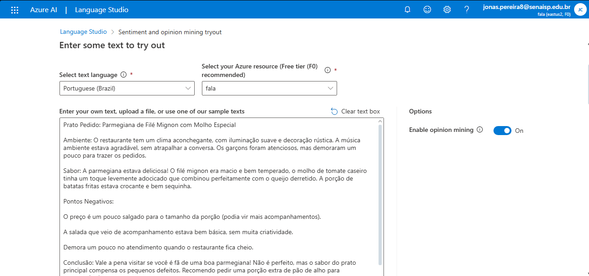

# Guia Prático: Análise de Sentimentos com Azure Language Studio

## 📋 Introdução
Este guia documenta passo a passo minha experiência na configuração e utilização do Azure Language Studio para análise de sentimentos, desenvolvido como parte de um desafio acadêmico da faculdade utilizando a assinatura Azure for Students.

## 🛠️ Configuração Inicial - Passo a Passo Detalhado

### 1. Criando o Grupo de Recursos
1. **Acesse o [Portal do Azure](https://portal.azure.com)**  
2. Clique em:  
   `Grupo de recursos` > `Criar`  
3. **Selecione sua assinatura**:  
   `Azure for Students` (para testes sem consumo de créditos)  
4. **Nomeie o grupo**:  
   - Sugestão: `gr_speak`  
   - 🔹 *Por que "gr_"?* Este prefixo ajuda na organização e identificação rápida  
5. Complete o processo de criação  

### 2. Configurando o Recurso de Language Studio
1. **Após criar o grupo de recursos**:  
   - Clique na seta `"mais serviços"`  
   - Seja redirecionado para `"Todos os serviços"`  

2. **Localize o serviço**:  
   - Na seção `IA + Machine Learning`  
   - Selecione `Language`  

3. **Clique em**:  
   `"Continue to create your resource"`  

4. **Preencha os parâmetros**:  
   | Configuração | Valor/Instrução |
   |--------------|-----------------|
   | Assinatura | `Azure for Students` |
   | Grupo de recursos | Selecione o grupo criado (`gr_speak`) |
   | Região | `East US` (garante disponibilidade do plano gratuito) |
   | Tipo de preço | `Free F0 (5K Transactions per 30 days)` |
   | Nome | Dê um nome descritivo (ex: `fala`) |

5. **Aceite os termos**:  
   ✅ Marque a caixa:  
   `"Ao marcar essa caixa, declaro que analisei e confirmo os termos no Aviso de Uso Responsável da IA."`  

6. **Finalize**:  
   `Revisar + criar` > `Criar`

### 3. Acessando o Language Studio
**Após a criação do recurso**:
1. **Opção 1 (direta)**:  
   Acesse [https://language.cognitive.azure.com/home](https://language.cognitive.azure.com/home)

2. **Opção 2 (pelo portal)**:  
   - Acesse seu grupo de recursos (`gr_speak`)  
   - Clique no recurso criado (ex: "analise-sentimentos-facul")  
   - Role para baixo até a seção `"Getting Started"`  
   - Clique em `"Language Studio"`  

## 🔍 Realizando Análise de Sentimentos - Processo Completo

### Passo a Passo Prático
1. **No Language Studio**:  
   - Clique em `"Classificar texto"`  
   - Selecione `"Analyze sentiment and opinions"`  

2. **Configuração da análise**:  
   - Selecione o idioma do texto (ex: Português)  
   - Insira o texto para análise:  
     ```text
     "Prato Pedido: Parmegiana de Filé Mignon com Molho Especial

 


Ambiente: O restaurante tem um clima aconchegante, com iluminação suave e decoração rústica. A música ambiente ..."
     ```
     *🔹 Nota: Este exemplo foi gerado por IA como avaliação fictícia de restaurante*

3. **Execute a análise**:  
   - Desça a página  
   - Clique em `"Run"`  

### Resultados e Interpretação
**Saída típica da análise**:
- **Sentimento geral**: Misto  
- **Aspectos positivos**:  
  - Atendimento (confiança alta)  
  - Comida (qualidade reconhecida)  
- **Aspectos negativos**:  
  - Ambiente (problema com barulho)  
  - Preço (considerado elevado)  

**Aplicação prática**:
- Identifique pontos fortes para manter  
- Detecte oportunidades de melhoria  
- Analise padrões em múltiplas avaliações  
- Priorize ajustes baseados em feedback  

## 💡 Insights e Aprendizados

### ✅ Pontos Positivos da Experiência
- **Custo zero**: Plano Free F0 ideal para projetos acadêmicos  
- **Interface intuitiva**: Fluxo guiado facilita o primeiro uso  
- **Detecção precisa**: Identifica nuances mesmo em textos complexos  
- **Organização**: Prefixo "gr_" realmente melhora a gestão de recursos  

### ⚠️ Desafios e Soluções
| Desafio | Solução Adotada |
|---------|-----------------|
| Limite de 5.000 transações/mês | Planeje testes e use amostras representativas |
| Dificuldade para encontrar serviços | Use atalhos diretos e favoritos no portal |
| Limitação de caracteres | Divida textos grandes em partes menores |
| Termos técnicos da interface | Mantenha este guia como referência |

### 🚀 Aplicações Práticas no Trabalho
1. **Análise de feedbacks** Tendências de Satisfação
2. **Monitoramento de avaliações** em pesquisas institucionais  
3. **Processamento de respostas abertas** Detecção de Críticas Construtivas  
4. **Estudo de percepção** Análise de Emoções Específicas  

## 📌 Recomendações Essenciais
```diff
+ Convenção de nomes: Sempre use "gr_" para grupos de recursos
+ Verificação dupla: Confirme região e tipo de preço antes de criar
+ Documentação visual: Adicione screenshots em /screenshots

- Limites: Monitore seu uso mensal (5K transações)
- Termos: Nunca pule a leitura dos termos de IA responsável