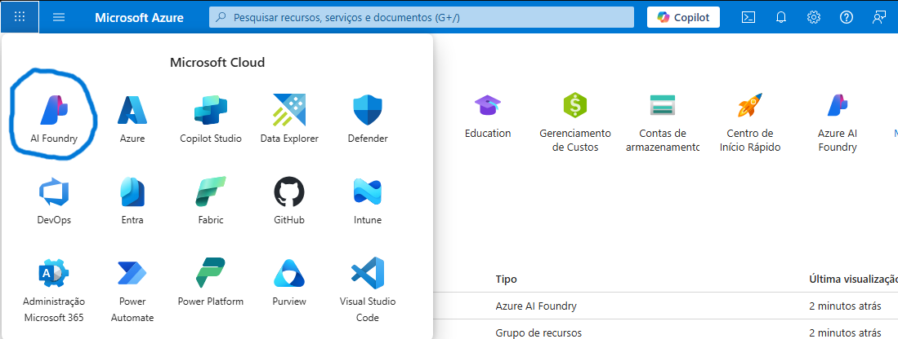
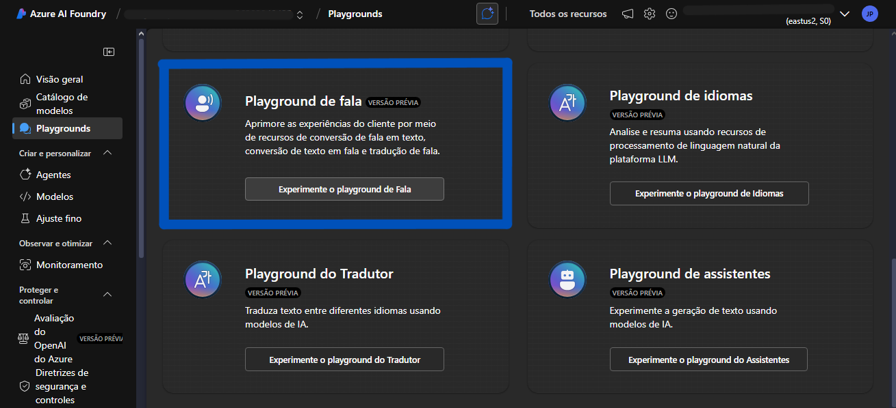
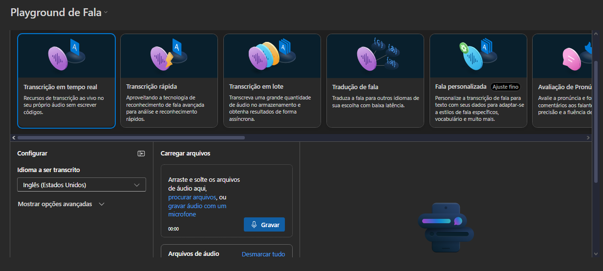

# Guia Prático: Transcrição de Fala com Azure Speech Services

##  Introdução
Este guia documenta passo a passo o processo completo de configuração e utilização do serviço de transcrição de fala do Azure, utilizando a assinatura **Azure for Students** para realizar testes sem consumo de créditos. Desenvolvido como parte de um laboratório acadêmico para aprendizado prático de soluções de IA.

##  Configuração Inicial - Passo a Passo

### 1. Criando o Grupo de Recursos
1. **Acesse o [Portal do Azure](https://portal.azure.com)**
2. Clique em:
   - `Grupo de recursos`
   - Botão `Criar`

3. **Configurações essenciais**:
   - **Assinatura**: Selecione `Azure for Students` (para testes sem consumo de créditos)
   - **Nome**: 
     - Sugestão: `rg-plan_transcription` 
     - 🔹 *Por que "gr_"?* Este prefixo ajuda na organização e diferenciação de grupos
     - Exemplo pessoal: `rg-plan_transcription`

### 2. Criando o Recurso de Speech Service
1. **Após criar o grupo de recursos**:
   - Clique na seta `"mais serviços"`
   - Seja redirecionado para `"Todos os serviços"`

2. **Localize o serviço**:
   - Na seção `IA + Machine Learning`
   - Selecione `Speech services`
   - Clique em `"Criar speech service"`

3. **Configurações críticas**:
   | Parâmetro | Valor/Instrução |
   |-----------|-----------------|
   | Assinatura | `Azure for Students` |
   | Grupo de recursos | Selecione o grupo criado anteriormente |
   | Região | `East US` (garante disponibilidade do plano gratuito) |
   | Tipo de preço | `Free F0` |

    **Atenção crucial**:
   - Se o plano Free F0 não aparecer:
     - Você pode ter usado o plano gratuito em outro recurso
     - Solução: Exclua recursos antigos não utilizados para liberar a cota gratuita

### 3. Acessando o Speech Studio (AI Foundry)

**Após criar o recurso de Speech**:
1. Clique no logo `"Microsoft Azure"` para voltar à home
2. No canto superior esquerdo, clique nos `9 quadradinhos` (ícone do Microsoft Cloud)
3. Na mini-aberta que aparece:
   - Selecione `"AI Foundry"`

##  Realizando Transcrição de Fala

### Processo Completo
1. **No AI Foundry**:
   - Clique em `"Playground"`
   - Verifique se está selecionada a função:
     ``` 
     Transcrição em tempo real
     ```

2. **Carregando o áudio**:
   - Clique em `"Procurar arquivos"`
   - Selecione o arquivo de áudio da sua máquina
   - Formatos suportados: `.wav`, `.mp3`, `.ogg`

3. **Resultados**:

   - A transcrição aparecerá automaticamente
   - Opção para baixar os resultados em `.txt`

##  Dicas Técnicas e Observações

### Melhores Práticas
```diff
+ Nomeação: Sempre use prefixo "gr_" para grupos de recursos
+ Região: Mantenha "East US" para garantia do plano gratuito
+ Limpeza: Exclua recursos não utilizados para liberar cotas

- Evite múltiplos recursos gratuitos na mesma região
- Não ignore os termos de uso responsável de IA